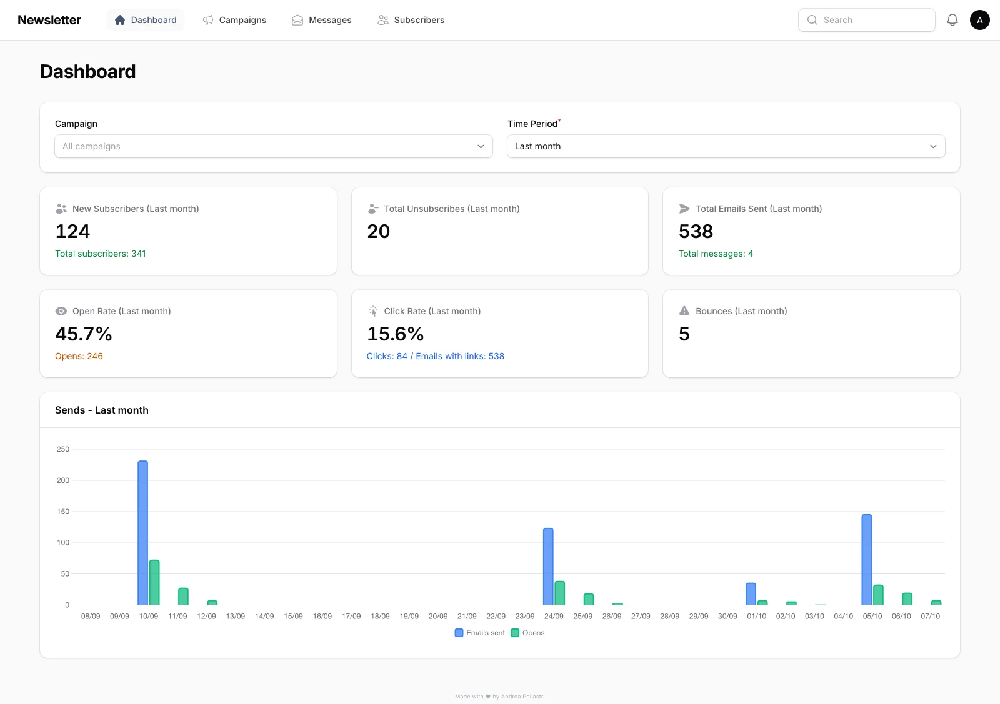
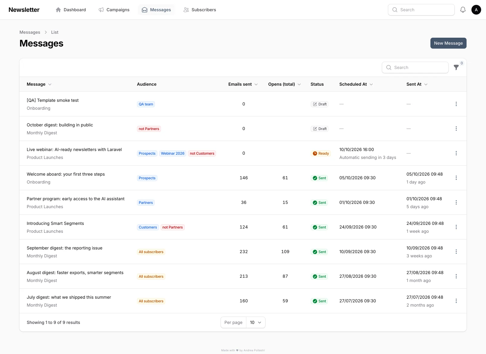
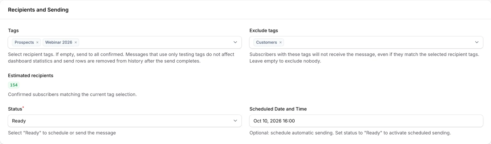
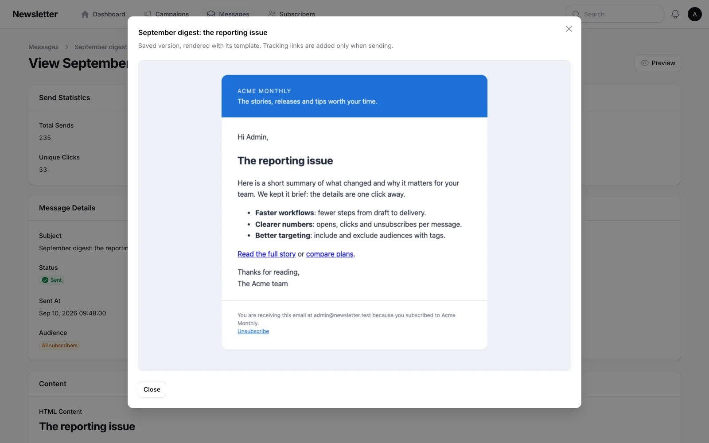
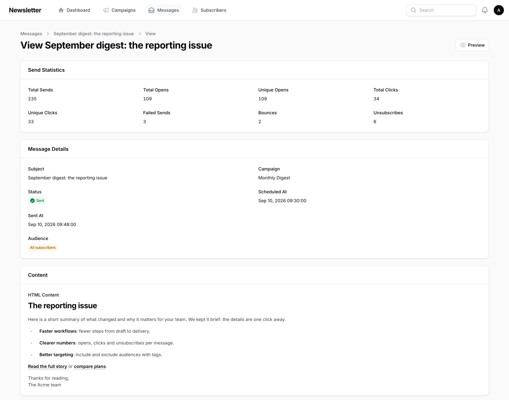
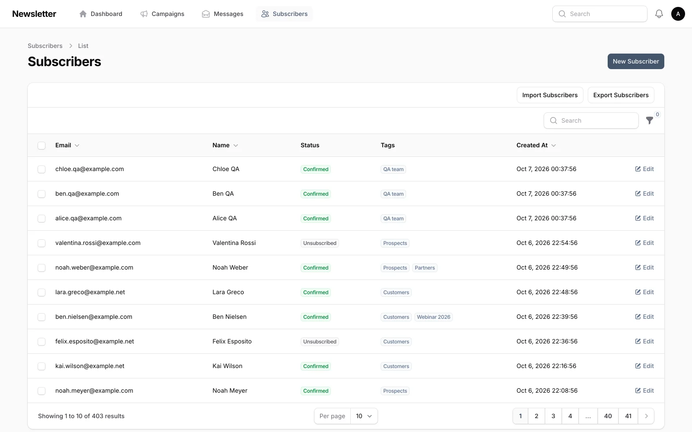
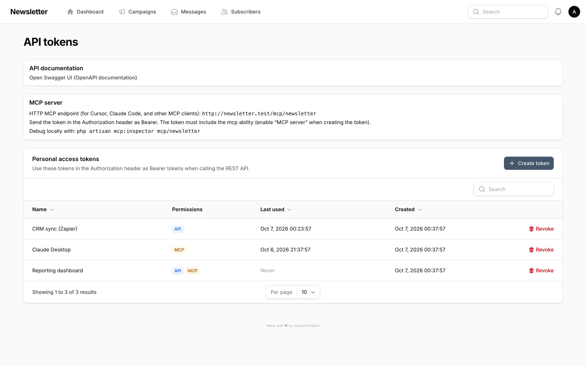
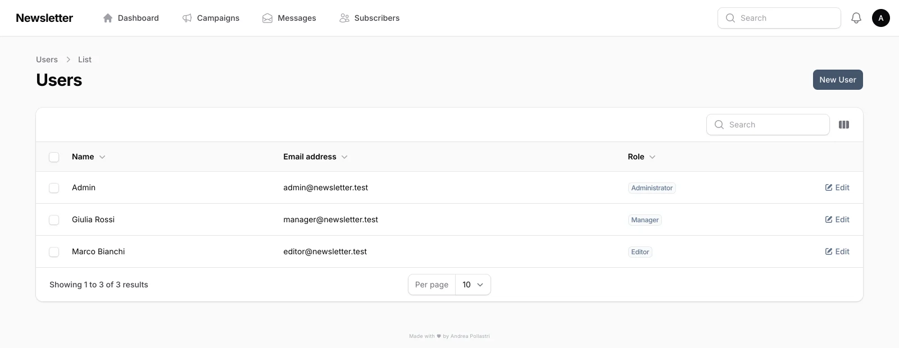
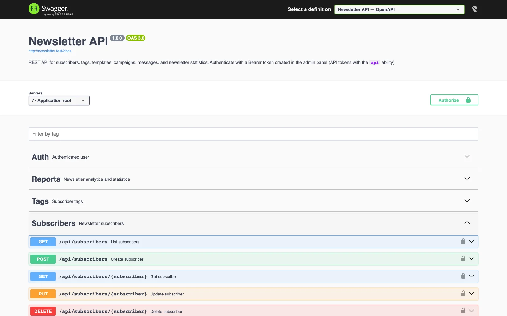
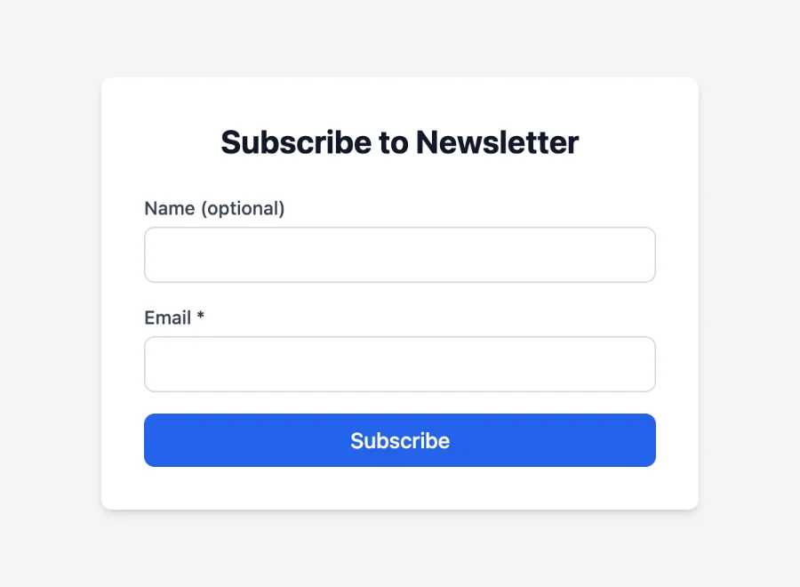

# Newsletter System

**Version 2.2.0** — [Changelog](CHANGELOG.md) · [Website & docs](https://newsletter.web.ap.it/)

A complete newsletter management system for Laravel, built with Filament. Manage subscribers, campaigns, HTML templates, scheduled sending, and full tracking — all from a modern admin panel. Includes a REST API, OpenAPI documentation, and an MCP server for AI integrations.



> Screenshots in this README come from a real local install seeded with `php artisan newsletter:seed-data`.

---

## Table of Contents

- [Features](#features)
- [Screenshots](#screenshots)
- [User Management & Roles](#user-management--roles)
- [Requirements](#requirements)
- [Installation](#installation)
- [Configuration](#configuration)
- [Quick Start](#quick-start)
- [Sending Newsletters](#sending-newsletters)
- [Monitoring & Analytics](#monitoring--analytics)
- [Rate Limiting](#rate-limiting)
- [REST API](#rest-api)
- [MCP Server (AI Integrations)](#mcp-server-ai-integrations)
- [Testing Tags](#testing-tags)
- [Multilingual Support](#multilingual-support)
- [Public Routes](#public-routes)
- [Scheduled Tasks](#scheduled-tasks)
- [Artisan Commands](#artisan-commands)
- [Troubleshooting](#troubleshooting)

---

## Features

| Feature                   | Description                                                          |
| ------------------------- | -------------------------------------------------------------------- |
| **Subscriber Management** | Import/export CSV, tagging, status management                        |
| **Campaigns & Messages**  | Hierarchical organization of campaigns and messages                  |
| **HTML Templates**        | Customizable templates with placeholder support                      |
| **Scheduled Sending**     | Automatic delivery via cron                                          |
| **Full Tracking**         | Unique opens/clicks per send, plus unsubscribe tracking              |
| **Targeting**             | Include and exclude tags, with a live estimated recipients count     |
| **Email Preview**         | Render messages and templates in a sandboxed preview before sending  |
| **Dashboard**             | Statistics and monitoring widgets                                    |
| **Rate Limiting**         | Configurable per-minute, per-hour, and per-day limits                |
| **Bounce Detection**      | Optional IMAP processing of RFC 3464 delivery reports                |
| **One-click Unsubscribe** | `List-Unsubscribe` + `List-Unsubscribe-Post` headers (RFC 8058)      |
| **REST API**              | Full CRUD API with Sanctum authentication and OpenAPI docs           |
| **MCP Server**            | AI integration endpoint for Cursor, Claude Code, and other clients   |
| **Testing Tags**          | Mark tags as testing to exclude sends from production statistics     |
| **Multilingual**          | Admin panel in Italian, English, German, French, Spanish, Portuguese |
| **UTM Tracking**          | Automatic UTM parameters on signed, tracked outbound links           |
| **Demo Data**             | `newsletter:seed-data` builds a realistic dataset to explore the app |
| **User Roles**            | Three permission levels: Editor, Manager, Administrator              |

---

## Screenshots

| Messages and audiences | Include / exclude targeting |
| --- | --- |
|  |  |
| **Email preview** | **Per-message statistics** |
|  |  |
| **Subscribers** | **API tokens & MCP** |
|  |  |

---

## User Management & Roles

The application supports three user roles with progressively broader permissions. Every user is assigned exactly one role, stored in the `role` column of the `users` table.

### Roles

| Role              | Description                                                                                       |
| ----------------- | ------------------------------------------------------------------------------------------------- |
| **Editor**        | Focused on content creation. Can create and manage **draft** messages within existing campaigns.  |
| **Manager**       | Full operational access. Manages campaigns, subscribers, tags, templates, and all message states. |
| **Administrator** | Everything a Manager can do, plus **user management** and **API token management**.               |

### Permission Matrix

| Area                                  | Editor | Manager | Administrator |
| ------------------------------------- | :----: | :-----: | :-----------: |
| **Dashboard**                         |   —    |    ✓    |       ✓       |
| **Campaigns** (view)                  |   ✓    |    ✓    |       ✓       |
| **Campaigns** (create/edit/delete)    |   —    |    ✓    |       ✓       |
| **Messages** (create)                 |   ✓    |    ✓    |       ✓       |
| **Messages** (view/edit/delete draft) |   ✓    |    ✓    |       ✓       |
| **Messages** (view sent/sending)      |   —    |    ✓    |       ✓       |
| **Subscribers**                       |   —    |    ✓    |       ✓       |
| **Tags**                              |   —    |    ✓    |       ✓       |
| **Templates**                         |   —    |    ✓    |       ✓       |
| **Users**                             |   —    |    —    |       ✓       |
| **API Tokens**                        |   —    |    —    |       ✓       |
| **Newsletter Report API**             |   —    |    ✓    |       ✓       |

### Navigation

- **Editor** — lands on the **Campaigns** page after login; the dashboard is not shown in navigation.
- **Manager / Administrator** — lands on the **Dashboard**; all navigation items are visible according to the matrix above.
- **User menu** — the **API Tokens** and **Users** links appear only for Administrators.

### Managing Users

Administrators can create, edit, and delete users from the **Users** page in the admin panel. When creating or editing a user, the following fields are available:

- **Name** and **Email** (required)
- **Password** (required on create, optional on edit — leave blank to keep unchanged)
- **Role** — select Editor, Manager, or Administrator
- **Locale** — preferred language for the admin panel UI

An administrator cannot delete their own account.



### Migrations

When upgrading from a version without roles, two migrations handle the transition:

1. `add_role_to_users_table` — adds the `role` column (defaults to `editor`).
2. `set_all_existing_users_to_legacy_administrator_role` — promotes all pre-existing users to `administrator` so they retain full access.

On a fresh install, the **first account** created without an explicit role (for example with `php artisan make:filament-user`) becomes an **Administrator**. Later accounts without a role default to **Editor**.

---

## Requirements

- PHP 8.3+
- Laravel 13
- Filament 5
- Database (SQLite, MySQL, or PostgreSQL)
- Queue driver (database, Redis, etc.)
- Node.js 22+ (only to build the frontend assets)

---

## Installation

1. **Clone the repository and install dependencies:**

```bash
git clone <repository-url> newsletter
cd newsletter
composer install
```

1. **Configure the environment:**

```bash
cp .env.example .env
php artisan key:generate
```

1. **Run migrations:**

```bash
php artisan migrate
```

1. **Build frontend assets:**

```bash
npm install
npm run build
```

1. **Create an admin user** (if not using seed data). The first user becomes an Administrator:

```bash
php artisan make:filament-user
```

1. **Generate API documentation** (optional):

```bash
php artisan l5-swagger:generate
```

---

## Configuration

### Mail

Configure your SMTP settings in `.env`:

```env
MAIL_MAILER=smtp
MAIL_HOST=your-smtp-host.com
MAIL_PORT=587
MAIL_USERNAME=your-username
MAIL_PASSWORD=your-password
MAIL_FROM_ADDRESS="newsletter@yourdomain.com"
MAIL_FROM_NAME="${APP_NAME}"
```

### Newsletter

| Variable                           | Description                                 | Default |
| ---------------------------------- | ------------------------------------------- | ------- |
| `NEWSLETTER_TRACKING_ENABLED`      | Enable open/click tracking                  | `true`  |
| `NEWSLETTER_RATE_LIMIT_PER_MINUTE` | Max sends per rolling minute (`0` = no cap) | `0`     |
| `NEWSLETTER_RATE_LIMIT_PER_HOUR`   | Max sends per rolling hour (`0` = no cap)   | `0`     |
| `NEWSLETTER_RATE_LIMIT_PER_DAY`    | Max sends per rolling day (`0` = no cap)    | `0`     |

See [Rate limiting](#rate-limiting) for behaviour and tuning.

### IMAP (Bounce Detection)

Bounce detection is **optional and disabled by default**. It requires an extra Composer package that is not shipped with the app:

```bash
composer require webklex/laravel-imap
```

Then enable and configure IMAP:

```env
NEWSLETTER_IMAP_ENABLED=true
NEWSLETTER_IMAP_HOST=imap.yourdomain.com
NEWSLETTER_IMAP_PORT=993
NEWSLETTER_IMAP_USERNAME=your-username
NEWSLETTER_IMAP_PASSWORD=your-password
NEWSLETTER_IMAP_ENCRYPTION=ssl
NEWSLETTER_IMAP_FOLDER=INBOX
```

When disabled, missing credentials, or without `webklex/laravel-imap`, `newsletter:process-bounces` exits cleanly and does nothing.

How reports are interpreted:

- **Delivery-status notifications (RFC 3464)** — when the report carries `Final-Recipient` / `Action` / `Status` fields (Postfix, Exim, Gmail, Exchange…), only recipients with `Action: failed` bounce. `5.x.x` status codes are **hard** bounces, `4.x.x` are **soft**.
- **Delay warnings** (`Action: delayed`, "Delayed Mail (still being retried)", "Delivery Status Notification (Delay)") are ignored: the MTA is still retrying.
- **Other reports** fall back to keyword detection; your own `MAIL_FROM_ADDRESS` and IMAP username are never treated as bounced recipients.
- The bounce is linked to the original send (tracking URL in the returned message, also when quoted-printable encoded) or to the subscriber's latest send, and any opens/clicks recorded for that send are discarded (mail clients load the tracking pixel of the returned copy).

### API Documentation (Swagger)

To auto-generate the OpenAPI spec on every request in local development:

```env
L5_SWAGGER_GENERATE_ALWAYS=true
```

For production, run `php artisan l5-swagger:generate` during deploy.

---

## Quick Start

1. **Seed demo data** (optional, recommended for a first look):

```bash
php artisan newsletter:seed-data
```

This creates a realistic, reproducible dataset: 400 subscribers (`--subscribers=` to change it) with mixed statuses and tags, three templates and campaigns, six sent messages with opens, clicks, bounces and unsubscribes, plus a scheduled message, drafts and a testing-tag message. All addresses use reserved `example.*` domains. Re-running it is safe, and it refuses to run in `production` unless you pass `--force`.

1. **Start the queue worker:**

```bash
./start-worker.sh
```

Or manually:

```bash
php artisan queue:work --tries=3 --timeout=90
```

1. **Access the admin panel:**

- **URL:** `https://newsletter.test` (Laravel Herd) or `http://localhost:8000`
- **Default credentials** (after seeding): `admin@newsletter.test` / `password`

---

## Sending Newsletters

### Immediate Sending

1. Go to **Newsletter > Messages**
2. Create a new message or select an existing one
3. Set status to **Ready**
4. Click **Send Now**
5. Emails are queued and sent automatically via the queue worker

### Scheduled Sending

1. Create or edit a message
2. Set the **Scheduled Date** field
3. The system sends automatically at the scheduled time (requires cron — see [Scheduled Tasks](#scheduled-tasks))

If a due message matches no confirmed subscriber, it is moved back to **Draft** and every user gets a notification. Sending is idempotent: a subscriber never gets two send rows for the same message, even if sending is triggered twice.

### Audience

- **Tags** — subscribers with **any** of the selected tags receive the message. No tags = all confirmed subscribers.
- **Exclude tags** — subscribers with **at least one** of these tags are removed, even if they match an include tag (e.g. *Customers*, but not *Partners*). A tag cannot be both included and excluded.
- **Estimated recipients** — live count of confirmed subscribers matching the current selection (Managers and Administrators).

### Preview and Test

- **Preview** (messages table, message view/edit pages, templates) renders the saved email inside its template in a sandboxed frame, personalised with your name.
- **Send Test** delivers the message to any address, without tracking, with a `[TEST]` subject prefix.


### Unsubscribe Headers

Every newsletter carries `List-Unsubscribe` and `List-Unsubscribe-Post: List-Unsubscribe=One-Click` (RFC 8058), so Gmail, Yahoo and Outlook can show their native unsubscribe button. Make sure your MTA DKIM-signs these headers.

### Link Tracking

When tracking is enabled, links are rewritten to `/track/click/{send}` with UTM parameters and a **signature** that binds the destination to the send, so the endpoint cannot be used as an open redirect. Links sent by earlier versions (unsigned) keep working as long as their send row exists. `mailto:`, `tel:` and `#anchor` links are left untouched.

---

## Monitoring & Analytics

- **Dashboard:** Main KPIs plus a daily chart of emails sent and opens, filterable by campaign and period
- **Messages:** Status, audience and send counts per message
- **Message Details:** Sends, opens, clicks, failures, bounces and unsubscribes, plus per-recipient tracking

---

## Rate Limiting

Configure how many emails the queue may send using rolling windows (stored in the app cache). Set a variable to **`0`** to turn off that cap; the other caps still apply.

| Env variable                       | Window | Typical use                                                               |
| ---------------------------------- | ------ | ------------------------------------------------------------------------- |
| `NEWSLETTER_RATE_LIMIT_PER_MINUTE` | ~1 min | Burst control; low values cause jobs to `release()` often (short delays). |
| `NEWSLETTER_RATE_LIMIT_PER_HOUR`   | ~1 h   | Provider hourly quotas.                                                   |
| `NEWSLETTER_RATE_LIMIT_PER_DAY`    | ~24 h  | Daily provider caps.                                                      |

**How sending works:** for each queued send, `SendNewsletterEmail` checks **daily**, then **hourly**, then **per-minute** (`App\Services\EmailRateLimiter`). The send proceeds only if it fits under every enabled limit; otherwise the job is **released** with a delay and no quota is consumed for that attempt.

**Throughput:** in practice the **tightest** of your enabled limits dominates (e.g. high hourly but low per-minute still throttles bursts).

**Estimated time:** while a message is in **Sending**, the UI uses the same three env-driven values to approximate completion (`Message::getEstimatedSendTime()`).

**Example** (adjust to your SMTP limits):

```env
NEWSLETTER_RATE_LIMIT_PER_MINUTE=0
NEWSLETTER_RATE_LIMIT_PER_HOUR=1000
NEWSLETTER_RATE_LIMIT_PER_DAY=10000
```

Keeping `PER_MINUTE=0` and using only hourly/daily is a common choice for large campaigns to avoid many small queue delays.

**Queue / worker:** ensure the worker `--timeout` stays a few seconds **below** your database queue `retry_after` (see `config/queue.php`, `DB_QUEUE_RETRY_AFTER`) so jobs are not processed twice.

**Check current counters:**

```bash
php artisan newsletter:rate-limits
```

---

## REST API

The application exposes a full REST API authenticated via **Laravel Sanctum** personal access tokens.

### Authentication

1. Go to the admin panel **user menu > API tokens** (or navigate to `/api-tokens`)
2. Create a token with the **API** ability enabled
3. Use the token in the `Authorization` header:

```
Authorization: Bearer <your-token>
```

### Endpoints

All endpoints are prefixed with `/api` and require a valid Bearer token with the `api` ability.

| Method   | Endpoint                                       | Description                    |
| -------- | ---------------------------------------------- | ------------------------------ |
| `GET`    | `/api/user`                                    | Authenticated user info        |
| `GET`    | `/api/reports/newsletter`                      | Newsletter report (filterable) |
| `GET`    | `/api/tags`                                    | List all tags                  |
| `POST`   | `/api/tags`                                    | Create a tag                   |
| `GET`    | `/api/tags/{tag}`                              | Show a tag                     |
| `PUT`    | `/api/tags/{tag}`                              | Update a tag                   |
| `DELETE` | `/api/tags/{tag}`                              | Delete a tag                   |
| `GET`    | `/api/subscribers`                             | List subscribers               |
| `POST`   | `/api/subscribers`                             | Create a subscriber            |
| `GET`    | `/api/subscribers/{subscriber}`                | Show a subscriber              |
| `PUT`    | `/api/subscribers/{subscriber}`                | Update a subscriber            |
| `DELETE` | `/api/subscribers/{subscriber}`                | Delete a subscriber            |
| `GET`    | `/api/templates`                               | List templates                 |
| `POST`   | `/api/templates`                               | Create a template              |
| `GET`    | `/api/templates/{template}`                    | Show a template                |
| `PUT`    | `/api/templates/{template}`                    | Update a template              |
| `DELETE` | `/api/templates/{template}`                    | Delete a template              |
| `GET`    | `/api/campaigns`                               | List campaigns                 |
| `POST`   | `/api/campaigns`                               | Create a campaign              |
| `GET`    | `/api/campaigns/{campaign}`                    | Show a campaign                |
| `PUT`    | `/api/campaigns/{campaign}`                    | Update a campaign              |
| `DELETE` | `/api/campaigns/{campaign}`                    | Delete a campaign              |
| `GET`    | `/api/campaigns/{campaign}/messages`           | List messages in a campaign    |
| `POST`   | `/api/campaigns/{campaign}/messages`           | Create a message               |
| `GET`    | `/api/campaigns/{campaign}/messages/{message}` | Show a message                 |
| `PUT`    | `/api/campaigns/{campaign}/messages/{message}` | Update a message               |
| `DELETE` | `/api/campaigns/{campaign}/messages/{message}` | Delete a message               |

### OpenAPI Documentation

Interactive Swagger UI is available at `/api/documentation`. Generate or update the spec with:

```bash
php artisan l5-swagger:generate
```



---

## MCP Server (AI Integrations)

The application includes a **Model Context Protocol (MCP)** server that allows AI clients (Cursor, Claude Code, Windsurf, etc.) to interact with your newsletter data.

### Endpoint

```
/mcp/newsletter
```

Authenticated with a Sanctum Bearer token that has the **`mcp`** ability.

### Available Tools

| Tool                           | Description                                                                        |
| ------------------------------ | ---------------------------------------------------------------------------------- |
| `list-campaigns`               | Lists campaigns (all campaigns for managers/administrators; editors see their own) |
| `newsletter-report`            | Delivery report with summary, per-message stats, and daily timeseries              |
| `send-history-analysis`        | Highlights and trends from recent send history                                     |
| `subscriber-insights`          | Audience breakdown by tags and statuses                                            |
| `generate-email-template-html` | Generates responsive HTML email template from a description                        |
| `create-newsletter-message`    | Creates a draft or ready message inside a campaign                                 |

### Prompt

The server ships with a `newsletter-assistant` prompt — a reusable skill template that guides AI assistants through campaign planning, report interpretation, content drafting, and message creation.

### Setup in Your AI Client

1. Create a token in the admin panel with the **MCP** ability
2. Configure your AI client to connect to the MCP endpoint with the token as Bearer auth
3. Debug locally with: `php artisan mcp:inspector mcp/newsletter`

### VS Code / Cursor `mcp.json` example (HTTP)

Point the URL at your app’s origin plus `/mcp/newsletter`, and send the Sanctum token in the `Authorization` header:

```json
{
    "mcpServers": {
        "newsletter": {
            "url": "https://your-domain.example/mcp/newsletter",
            "headers": {
                "Authorization": "Bearer YOUR_SANCTUM_TOKEN"
            }
        }
    }
}
```

Replace `your-domain.example` with your deployment host (for local development, something like `http://127.0.0.1:8000/mcp/newsletter`). Replace `YOUR_SANCTUM_TOKEN` with the plaintext token string from the admin panel (treat it like a password).

### Example requests

You can phrase tasks in natural English; the assistant maps them to MCP tools. Examples:

- **Campaigns:** “List all newsletter campaigns.” / “What campaigns do we have?”
- **Delivery stats:** “Give me a newsletter delivery report from **2026-01-01** to **2026-01-31**.” / “Show sends, opens, clicks, and bounces for the last 30 days.”
- **Scoped report:** “Report for the campaign with id **…** between **2026-01-01** and **2026-01-31**.”
- **Narrative summary:** “Summarize send history and highlights for the last quarter.”
- **Audience:** “How many subscribers do we have by status? Which tags have the most subscribers?”
- **HTML:** “Generate a responsive HTML email template for a product launch: hero, short intro, three feature bullets, primary CTA button.”
- **New message:** “Create a **draft** message in the given campaign id, using the given template id, subject **Weekly digest**, HTML body **…**, and the listed tag ids.”

For **send statistics** and **campaign listing**, use a token belonging to a **Manager** or **Administrator** if your organization splits campaign ownership across users; those roles see all campaigns in reports (same idea as the admin panel).

---

## Testing Tags

Tags can be marked as **testing** (`is_testing` flag) in the Filament admin panel. When a message targets recipients **only** through testing tags:

- Sends are **excluded from dashboard statistics** (emails sent, opens, clicks, bounces, charts)
- After the send completes, per-recipient send rows and related bounces are **removed** from the database
- Testing tags and normal tags **cannot be mixed** on the same message

This allows safe end-to-end testing of the sending pipeline without polluting production metrics.

---

## Multilingual Support

The admin panel supports six languages: **Italian**, **English**, **German**, **French**, **Spanish**, and **Portuguese**.

- Logged-in users can choose their language from the **Profile** page
- Before login, the panel detects the browser `Accept-Language` header and uses the closest supported language (defaults to English)
- New users automatically inherit the browser language on account creation

---

## Public Routes

The following routes are available for public use:

| Route                               | Method | Description                                                   |
| ----------------------------------- | ------ | ------------------------------------------------------------- |
| `/subscribe`                        | GET    | Subscription form                                             |
| `/subscribe`                        | POST   | Process subscription (10/min per IP, 5/hour per address)      |
| `/subscribe/confirm/{token}`        | GET    | Confirm subscription (double opt-in)                          |
| `/unsubscribe/{subscriber}`         | GET    | Unsubscribe form                                              |
| `/unsubscribe/{subscriber}`         | POST   | RFC 8058 one-click unsubscribe (no CSRF token, returns `204`) |
| `/unsubscribe/{subscriber}/confirm` | POST   | Confirm unsubscribe                                           |
| `/unsubscribe/test`                 | POST   | One-click target for test sends (no-op, returns `204`)        |
| `/track/open/{send}`                | GET    | Open-tracking pixel                                           |
| `/track/click/{send}`               | GET    | Signed click tracking and redirect                            |



---

## Scheduled Tasks

Add the Laravel scheduler to your crontab:

```bash
* * * * * cd /path-to-your-project && php artisan schedule:run >> /dev/null 2>&1
```

| Task                         | Schedule         | Description                                                      |
| ---------------------------- | ---------------- | ---------------------------------------------------------------- |
| `newsletter:send-scheduled`  | Every minute     | Sends messages with scheduled date in the past                   |
| `newsletter:process-pending` | Every 5 minutes  | Re-queues stuck pending sends and completes finished messages    |
| `newsletter:process-bounces` | Every 15 minutes | Processes bounced emails via IMAP (when enabled + package installed) |
| `backup:run`                 | Daily at 03:00   | Runs application backup                                          |
| `backup:clean`               | Daily at 04:00   | Cleans old backups                                               |

---

## Artisan Commands

| Command                        | Description                                                        |
| ------------------------------ | ------------------------------------------------------------------ |
| `newsletter:seed-data`         | Seed a realistic demo dataset (`--subscribers=`, `--force`)        |
| `newsletter:send-scheduled`    | Manually trigger scheduled message sending                         |
| `newsletter:process-pending`   | Process pending emails in the queue                                |
| `newsletter:process-bounces`   | Process bounced emails from IMAP                                   |
| `newsletter:rate-limits`       | Display current rate limit status                                  |
| `l5-swagger:generate`          | Generate or update the OpenAPI specification                       |
| `mcp:inspector mcp/newsletter` | Debug the MCP server locally                                       |

---

## Take it to production — cipi.sh

Once your app is ready, deploy it to any Ubuntu VPS with [cipi.sh](https://cipi.sh) — an open-source CLI built exclusively for Laravel.

- Full app isolation — own Linux user, PHP-FPM pool & database per app
- Zero-downtime deploys with instant rollback via Deployer
- Let's Encrypt SSL, Fail2ban, UFW firewall — all automated
- Multi-PHP (7.4 → 8.5), queue workers, S3 backups, auto-deploy webhooks
- AI Agent ready — any AI with SSH access can deploy & manage your server

```bash
wget -O - https://raw.githubusercontent.com/andreapollastri/cipi/refs/heads/latest/install.sh | bash
```

→ Learn more at [cipi.sh](https://cipi.sh)

---

## Troubleshooting

### Emails not sending

1. Ensure the queue worker is running: `./start-worker.sh` or `php artisan queue:work`
2. Manually process pending: `php artisan newsletter:process-pending`
3. Check the jobs table: `php artisan tinker --execute="DB::table('jobs')->count()"`

### Test email delivery

```bash
php artisan tinker --execute="Mail::raw('Test', fn(\$m) => \$m->to('test@example.com'))"
```

### Verify rate limits

```bash
php artisan newsletter:rate-limits
```

### Frontend changes not visible

Run `npm run build` or `npm run dev` to compile assets.

### API issues

1. Verify the token is valid: check the **API tokens** page in the admin panel
2. Ensure the token has the correct ability (`api` for REST endpoints, `mcp` for the MCP server)
3. Check the OpenAPI docs at `/api/documentation` for request/response format

---

## License

MIT

---

## Credits

Created by [Andrea Pollastri](https://web.ap.it)
